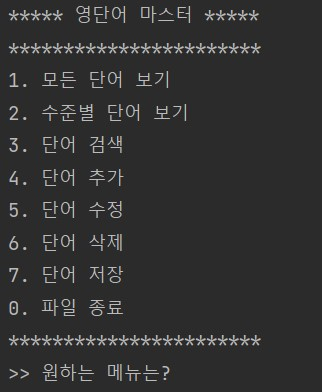
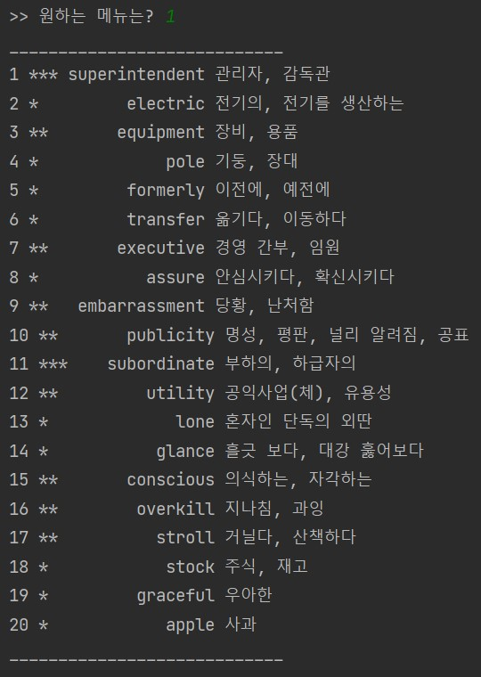
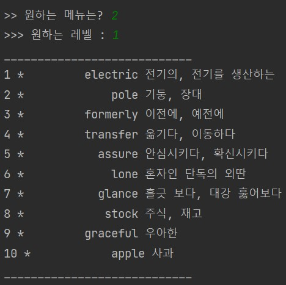
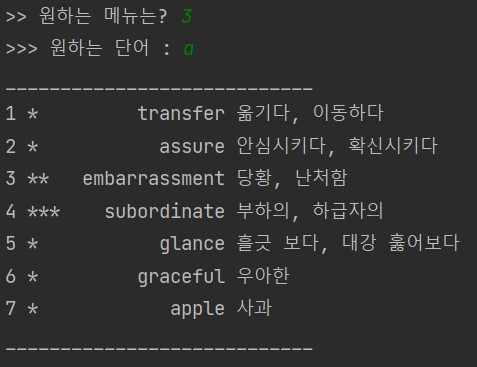
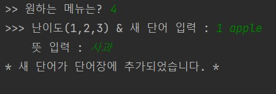
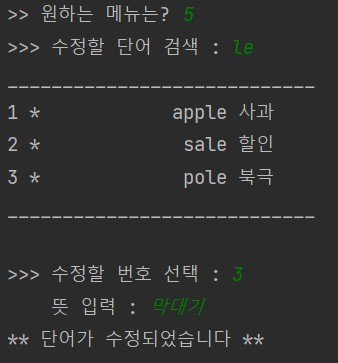
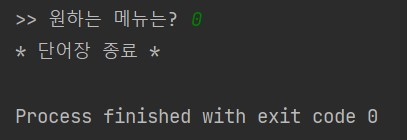

# EnglishDictionary_CRUD

## 설치 IDE
--intelliJ IDEA

## 실행 화면

#### 메뉴 선택
(load file) 

 

#### [1. 모든 단어 보기]

#### [2. 수준별 단어 보기]

#### [3. 단어 검색]

#### [4. 단어 추가]

#### [5. 단어 수정]

#### [6. 단어 삭제]

#### [7. 단어 저장]

#### [0. 나가기]

